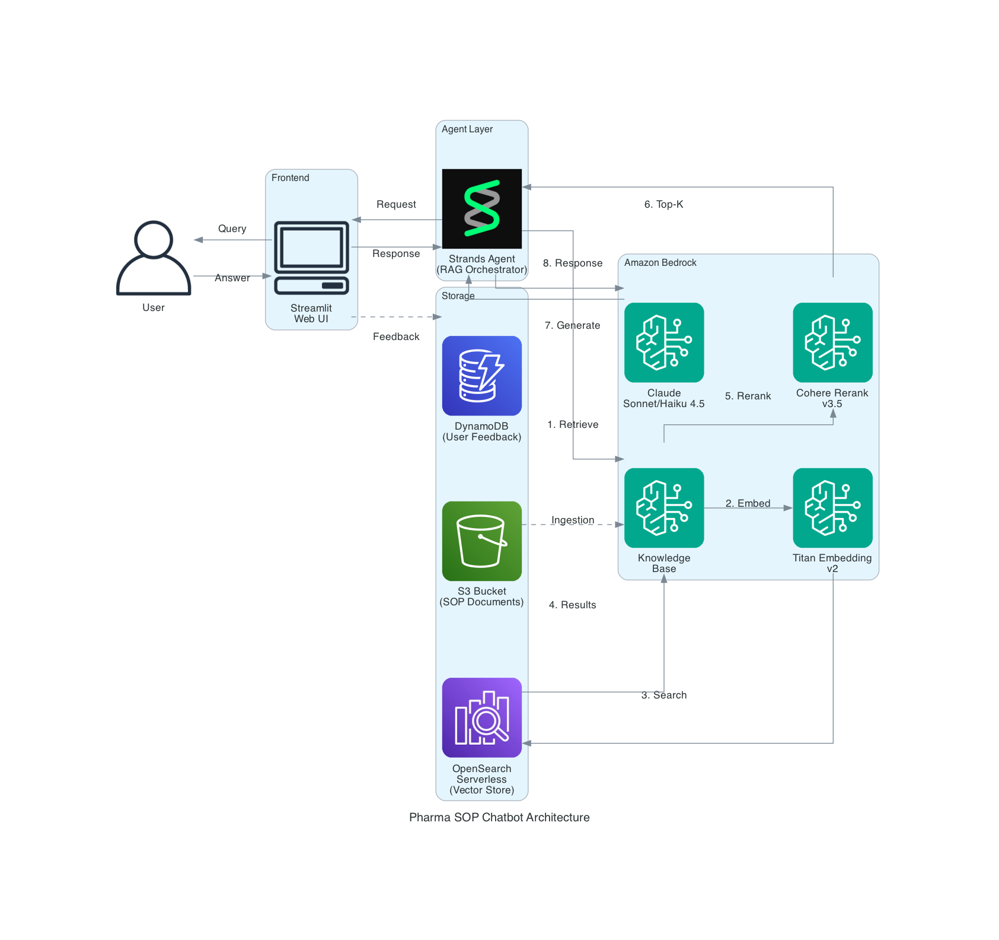

# Pharma SOP Chatbot

제약 산업 SOP(Standard Operating Procedure) 문서를 위한 RAG 기반 챗봇입니다. Amazon Bedrock Knowledge Base와 Strands Agents SDK를 활용합니다.

## 아키텍처



### 주요 컴포넌트

- **Amazon Bedrock Knowledge Base**: 문서 검색 및 RAG 엔진
- **OpenSearch Serverless**: 벡터 임베딩 저장소 (VECTORSEARCH 타입)
- **Amazon S3**: 소스 문서 저장소
- **Amazon Titan Embedding v2**: 텍스트 임베딩 모델 (1024 차원)
- **Cohere Rerank v3.5**: 검색 결과 재순위화
- **Strands Agents SDK**: 에이전트 기반 챗봇 프레임워크
- **Streamlit**: 웹 UI
- **DynamoDB**: 사용자 피드백 저장

### 데이터 흐름

1. 사용자가 Streamlit UI를 통해 질문 입력
2. Strands Agent가 Knowledge Base에 검색 요청
3. Titan Embedding v2로 쿼리 벡터화
4. OpenSearch Serverless에서 벡터 유사도 검색
5. Cohere Rerank로 검색 결과 재순위화
6. Claude 모델이 검색된 컨텍스트를 바탕으로 응답 생성
7. 사용자에게 응답 전달 및 피드백 수집

## 주요 기능

- 계층적 청킹(Hierarchical Chunking) 전략으로 문서 분할
  - Level 1: 1500 토큰
  - Level 2: 300 토큰
  - Overlap: 60 토큰
- Cohere Rerank를 통한 검색 결과 재순위화
- HNSW 알고리즘 기반 벡터 검색 (FAISS 엔진)
- Claude Sonnet 4 / Sonnet 4.5 / Haiku 4.5 모델 선택 가능
- 대화 히스토리 유지 (Sliding Window)
- 사용자 피드백 수집

## 사전 요구사항

1. AWS 계정 및 적절한 권한
  - 챗봇 실행 환경에서 필요한 권한 : Amazon S3, Amazon Dynamo DB, Amazon Bedrock
2. S3 버킷 생성 및 SOP 문서 업로드 완료
3. GMP Glossary CSV 파일 생성 및 업로드 완료 (경로 :/tmp/glossary/gmp_glossary.csv)
4. Python 3.12+

## 빠른 시작

### 1. Knowledge Base 인프라 배포

S3 버킷이 있는 리전과 동일한 리전에 배포해야 합니다.

```bash
aws cloudformation deploy \
  --template-file bedrock-knowledge-base.yaml \
  --stack-name pharma-sop-knowledge-base \
  --parameter-overrides \
    KnowledgeBaseName=pharma-sop-kb \
    S3BucketName=your-bucket-name \
    S3KeyPrefix="your-prefix/" \
    OpenSearchCollectionName=pharma-sop-collection \
  --capabilities CAPABILITY_NAMED_IAM \
  --region us-east-1
```

### 2. 스택 출력값 확인

```bash
aws cloudformation describe-stacks \
  --stack-name pharma-sop-knowledge-base \
  --region us-east-1 \
  --query 'Stacks[0].Outputs' \
  --output table
```

### 3. 데이터 소스 동기화

CloudFormation 출력에서 Knowledge Base ID와 Data Source ID를 확인하고 동기화를 실행합니다.

```bash
aws bedrock-agent start-ingestion-job \
  --knowledge-base-id <KNOWLEDGE_BASE_ID> \
  --data-source-id <DATA_SOURCE_ID> \
  --region us-east-1
```

동기화 상태 확인:

```bash
aws bedrock-agent get-ingestion-job \
  --knowledge-base-id <KNOWLEDGE_BASE_ID> \
  --data-source-id <DATA_SOURCE_ID> \
  --ingestion-job-id <JOB_ID> \
  --region us-east-1
```

### 4. 환경 설정

```bash
# 가상환경 생성 및 활성화
python -m venv .venv
source .venv/bin/activate

# 의존성 설치
pip install -r requirements.txt

# 환경 변수 설정
cp .env.example .env
```

`.env` 파일을 편집하여 Knowledge Base ID를 설정합니다:

```
AWS_REGION=us-east-1
KNOWLEDGE_BASE_ID=<YOUR_KNOWLEDGE_BASE_ID>
DYNAMODB_TABLE_NAME=user_feedback
```

### 5. 챗봇 실행

```bash
streamlit run app.py
```

브라우저에서 http://localhost:8501 로 접속합니다.

## 파일 구조

```
.
├── bedrock-knowledge-base.yaml  # CloudFormation 템플릿
├── app.py                       # Streamlit 웹 앱
├── agent.py                     # Strands Agent 및 RAG 로직
├── config.py                    # 설정 관리
├── feedback.py                  # 사용자 피드백 저장
├── requirements.txt             # Python 의존성
├── .env.example                 # 환경 변수 예시
└── README.md
```

## CloudFormation 파라미터

| 파라미터 | 설명 | 기본값 |
|---------|------|--------|
| KnowledgeBaseName | Knowledge Base 이름 | bedrock-kb |
| S3BucketName | 소스 문서가 저장된 S3 버킷 이름 | - |
| S3KeyPrefix | S3 버킷 내 문서 경로 필터 | "" |
| OpenSearchCollectionName | OpenSearch 컬렉션 이름 | bedrock-kb-collection |

## CloudFormation 출력값

| 출력 | 설명 |
|------|------|
| BedrockKnowledgeBaseId | Knowledge Base ID |
| BedrockKnowledgeBaseRoleArn | Knowledge Base IAM 역할 ARN |
| OpenSearchServerlessCollectionArn | OpenSearch 컬렉션 ARN |
| BedrockKnowledgeBaseDataSourceId | S3 데이터 소스 ID |

## 참고 자료

- [Amazon Bedrock Knowledge Base 문서](https://docs.aws.amazon.com/bedrock/latest/userguide/knowledge-base.html)
- [Strands Agents SDK](https://github.com/strands-agents/strands-agents)
- [OpenSearch Serverless 문서](https://docs.aws.amazon.com/opensearch-service/latest/developerguide/serverless.html)
